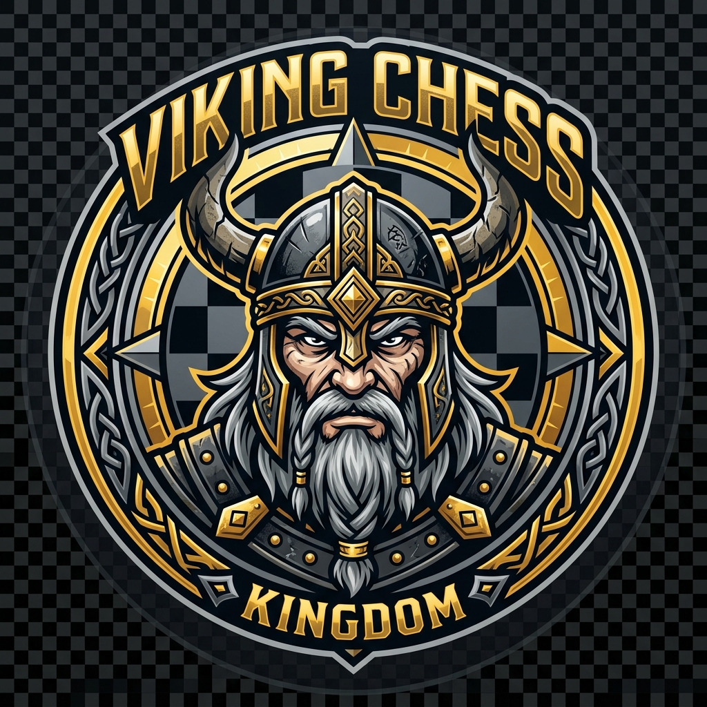

# ⚔️ VIKING'S Chess

<div align="center">



### *Master Every Move*

**A premium, full-stack 3D chess experience — built entirely from scratch, zero Stockfish.**

[](https://react.dev)
[](https://www.typescriptlang.org)
[](https://threejs.org)
[](https://socket.io)
[](https://vitejs.dev)
[](https://mongodb.com)

</div>

---

## 🎮 About the Project

**VIKING'S Chess** is a beautifully crafted, full-stack chess platform featuring an **immersive 3D board**, a **custom-built AI engine** (pure Negamax with alpha-beta pruning — no Stockfish), **real-time online multiplayer** via WebSockets, a full **ELO rating system**, and a **premium dark gold UI design** that feels like a luxury chess app.

This project was designed and built as a complete end-to-end chess game, from the 3D piece rendering all the way to the server-side game state management — every line of logic is custom-written.

---

## ✨ Features

### ♟️ Game Modes
| Mode | Description |
|------|-------------|
| **Human vs Human** | 2-player local pass-and-play on the same device |
| **Computer vs Human** | Single-player vs VIKING'S AI with 3 difficulty levels |
| **Online Multiplayer** | Real-time match via room codes — play with any friend anywhere |
| **Join by Code** | Enter a room code to join an existing online match |

### 🎯 Gameplay Features
- ✅ **Full chess rules** — castling, en passant, promotion, threefold repetition, 50-move rule
- ✅ **Drag & drop** + click-to-move piece control
- ✅ **Legal move hints** — green dots highlight valid squares
- ✅ **Check / Checkmate / Stalemate** detection with visual indicators
- ✅ **Move history** with algebraic notation (SAN)
- ✅ **Captured pieces** display for both sides
- ✅ **Undo / Redo** with opponent request system (online)
- ✅ **Resign** with confirmation modal
- ✅ **Game replay** — re-watch the last 4 moves
- ✅ **Board flip** — view from either side
- ✅ **Pawn promotion** modal with piece selection
- ✅ **Piece slide animations** — smooth movement transitions
- ✅ **Castle animation** — rook slides simultaneously

### ⏱️ Timer System
- 10-minute game clock for each player
- **One-time +3 minute bonus** when a timer hits 0:00 — shown with a 💔🩹 animation
- Timer persists across page refreshes (localStorage + DB sync)
- Timer works in all game modes including CvC

### 📊 ELO Rating System
- Starting ELO: **1200** for all players
- Dynamic ELO during game (live material advantage preview)
- Final ELO change calculated using the **standard K=32 formula**
- Ratings update after every match and persist to localStorage
- Displayed in match end screen with Before → After visualization

### 🤖 VIKING'S AI Engine
- **Custom Negamax algorithm** with alpha-beta pruning
- **3 difficulty levels**: Easy (1-ply), Intermediate (medium depth + heuristics), Hard (deep minimax)
- **Gemini API** integration for witty AI chat messages after each move
- AI responds to your chat messages in-game with contextual chess banter

### 🌐 Online Multiplayer
- Real-time via **Socket.io**
- Room-based system with shareable room codes (`VIKING-XXXXXX`)
- Opponent online/offline status indicator
- Disconnect countdown (5 minutes to reconnect)
- Synchronized game state — rejoining mid-game restores full board
- Live chat between players
- Undo/Redo/Reset require opponent approval

### 🎨 3D Visuals & Design
- **Three.js** / **React Three Fiber** powered 3D scene
- Fully rendered 3D chess pieces with physically-based materials
- **4 metallic finishes**: Chrome, Gold, Rose Gold, Gunmetal
- Adjustable **lighting intensity** slider
- Auto-rotating scene on the homepage
- **4 board themes**: Sandalwood, Emerald, Classic Blue, Crimson
- Premium dark UI with gold accents, glassmorphism panels, micro-animations

### 📱 Mobile Experience
- Fully responsive layout for all screen sizes
- **Mobile bottom icon bar** with 3 panel sections:
  - 📜 **History** — Move history + captured pieces
  - 💬 **Chat** — Live chat + emoji reactions  
  - ⚙️ **Controls** — Undo, Redo, Reset, Review, Resign
- Slide-up animated drawers with backdrop blur
- Touch-friendly drag & drop

---

## 🛠️ Tech Stack

### Frontend
| Technology | Purpose |
|-----------|---------|
| **React 19** | UI framework |
| **TypeScript** | Type safety |
| **Vite 6** | Build tool & dev server |
| **Three.js + R3F** | 3D chess scene rendering |
| **chess.js** | Chess move validation & game logic |
| **Socket.io-client** | Real-time WebSocket communication |
| **Lucide React** | Icon library |
| **Vanilla CSS** | Custom premium design system |

### Backend
| Technology | Purpose |
|-----------|---------|
| **Node.js + Express** | REST API server |
| **Socket.io** | WebSocket game server |
| **MongoDB + Mongoose** | Game state & player persistence |
| **Google Gemini API** | AI chat message generation |

---

## 🚀 Getting Started

### Prerequisites
- Node.js 18+
- MongoDB (local or Atlas)
- A Gemini API key (optional — fallback messages used if absent)

### Installation

```bash
# 1. Clone the repository
git clone https://github.com/Parthibanmuthukumar/Viking-Chess.git
cd Viking-Chess

# 2. Install dependencies
npm install

# 3. Create environment file
cp .env.example .env
# Edit .env with your MongoDB URI and API keys
```

### Environment Variables (`.env`)
```env
MONGODB_URI=mongodb://localhost:27017/vikingchess
PORT=3001
GEMINI_API_KEY=your_gemini_api_key_here
```

### Running Locally

```bash
# Terminal 1 — Start the backend server
npm run server

# Terminal 2 — Start the frontend dev server
npm run dev
```

Open [http://localhost:5173](http://localhost:5173) in your browser.

---

## 📁 Project Structure

```
Viking-Chess/
├── index.html              # Entry HTML — VIKING'S title & logo favicon
├── public/
│   ├── viking-logo.png     # App logo / favicon
│   ├── avatar-arjun.png    # Player avatar
│   ├── avatar-rohan.png    # Player avatar
│   └── avatar-computer.png # AI avatar
├── src/
│   ├── components/         # Reusable UI components
│   │   ├── ChessPiece2D.tsx    # Premium 2D SVG piece renderer
│   │   ├── ChessBoard.tsx      # 3D board component
│   │   ├── Scene.tsx           # Three.js 3D scene
│   │   └── IconRow.tsx         # Mobile icon row helper
│   ├── engine/
│   │   └── chessEngine.ts      # Custom Negamax AI engine
│   ├── hooks/
│   │   └── useSocket.ts        # Socket.io hook for online play
│   ├── pages/
│   │   ├── HomePage.tsx        # Landing page with 3D scene
│   │   └── GamePage.tsx        # Full game UI & logic (3000+ lines)
│   ├── index.css           # Complete design system (3000+ lines)
│   └── App.tsx             # Router setup
└── server/
    ├── index.js            # Express + Socket.io server
    └── models/             # MongoDB schemas
```

---

## 🎮 How to Play

1. **Open the app** → you'll see the 3D rotating chess board
2. **Customize** the metal color (Chrome / Gold / Rose Gold / Gunmetal) and lighting
3. **Click PLAY NOW** → choose your game mode
4. For **online play**: share the room code with your friend
5. **Click** a piece to select it (green dots show legal moves)
6. **Click** a destination square or **drag** the piece to move
7. Use the **bottom icon bar on mobile** to access history, chat, and controls

---

## 🏆 ELO System Details

- Both players start at **ELO 1200**
- During a game, ELO preview fluctuates based on material advantage
- On game end, final ELO is calculated:
  - Win: `+K × (1 − E)` where `E = 1/(1+10^((oppRating−myRating)/400))`
  - Loss: `−K × E`
  - Draw: `K × (0.5 − E)`
  - K = 32
- ELO updates persist across sessions and rematches

---

## 🔮 Roadmap

- [ ] Spectator mode for online games
- [ ] Tournament bracket system
- [ ] Opening book integration
- [ ] Puzzle mode (tactical puzzles)
- [ ] Voice commentary
- [ ] WebRTC video chat during games
- [ ] Mobile app (React Native)

---

## 🤝 Contributing

Pull requests are welcome! For major changes, please open an issue first.

1. Fork the repo
2. Create your feature branch: `git checkout -b feature/amazing-feature`
3. Commit your changes: `git commit -m 'Add amazing feature'`
4. Push to the branch: `git push origin feature/amazing-feature`
5. Open a Pull Request

---

## 👨‍💻 Author

**Parthiban Muthukumar**  
GitHub: [@Parthibanmuthukumar](https://github.com/Parthibanmuthukumar)

---

## 📄 License

This project is licensed under the MIT License.

---

<div align="center">

⚔️ **VIKING'S Chess** — *Battle of the Minds*

*Built with passion. Custom engine. Zero Stockfish.*

</div>
